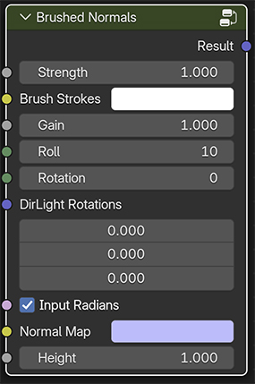
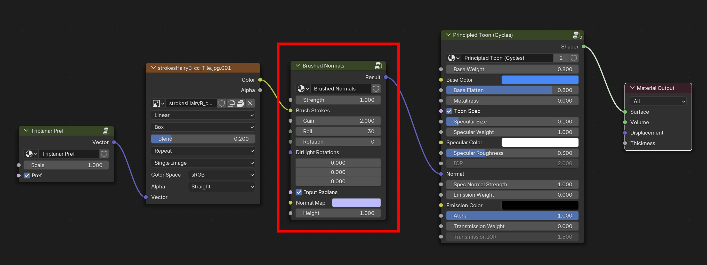

# Brushed Normals (yo)

Transforms smooth shading into brushstroke shading by rotating the object normals through the brush stroke map, mimicking how an artist paints strokes on a canvas to shade an object. 

 

## Inputs / Parameters

**Strength** 

A normalized slider to control the overall effect, from zero (no effect) to 1 (100%).

**Brush Strokes** 

This is where you input the brush strokes map, used to smear an object’s shading normals along the brush strokes. 

**Gain**

A modifier for the brush strokes map, acting as a multiplier, where a value of 1 does nothing, and value above 1 brighten the map, while values below 1 darken it. 

**Roll** 

Rotates the world normals based on a "paint-roller" effect. Effectively smearing the object’s shading normals along the brush strokes. 

**Rotation** 

Rotates the roller direction clockwise in degrees. The initial direction the "roller" travels is from the top of the screen downwards. A value of 45 will rotate the roll clockwise 45 degrees in screen space, and -45 will rotate counterclockwise 45 degrees.

**Dir Light Rotations**

Used to link the rotation values of a sun light to drive the roller direction so that the brush shading direction follows the light direction. The light’s rotations in world space are converted into screen space, determining the starting direction angle, and the rotation slider becomes an additional tool to tweak that angle. 

**Input as radians**

Light rotation values are passed by Blender as radians, rather than degrees. If you instead want to manually enter the rotations in degrees, you can simply uncheck this.

**Normal Map**

Input for tangent space normal maps

**Height**

Strength of the normal mapping effect.

## Example material node network

