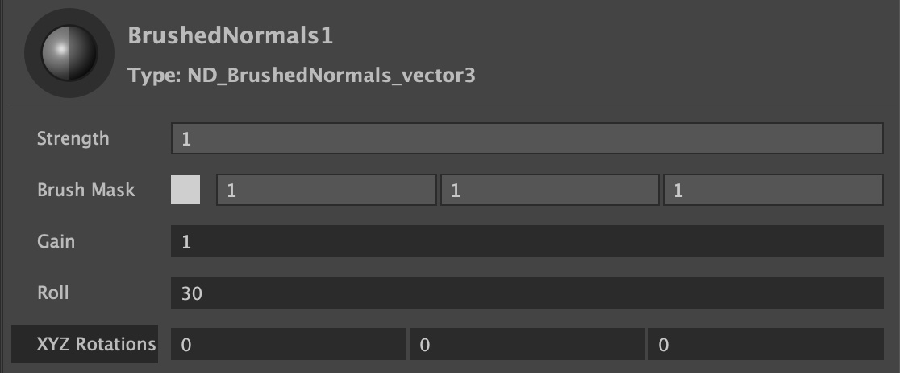

.
# Brushed Normals

Transforms regular smooth shading into brushed shading by rotating the object normals through the brush stroke map, mimicking how an artist paints strokes on a canvas to shade an object. 

 

## Inputs / Parameters

**Strength** 

A normalized slider to control the overall effect, from zero (no effect) to 1 (100%).

**Brush Mask** 

This is where you input the Triplanar brush strokes texture map, used to smear an object’s shading normals along the brush strokes. 

**Gain**

A modifier for the brush strokes map, acting as a multiplier, where a value of 1 does nothing, and value above 1 brighten the map, while values below 1 darken it. 

**Roll** 

Rotates the world normals based on a "paint-roller" effect. Effectively smearing the object’s shading normals along the brush strokes. 

**XYZ Rotation** 

Rotations in world space are converted into screen space, determining the starting direction angle of the roll. Internal yaw and pitch functions in the shader make this unnecessary in most cases.

