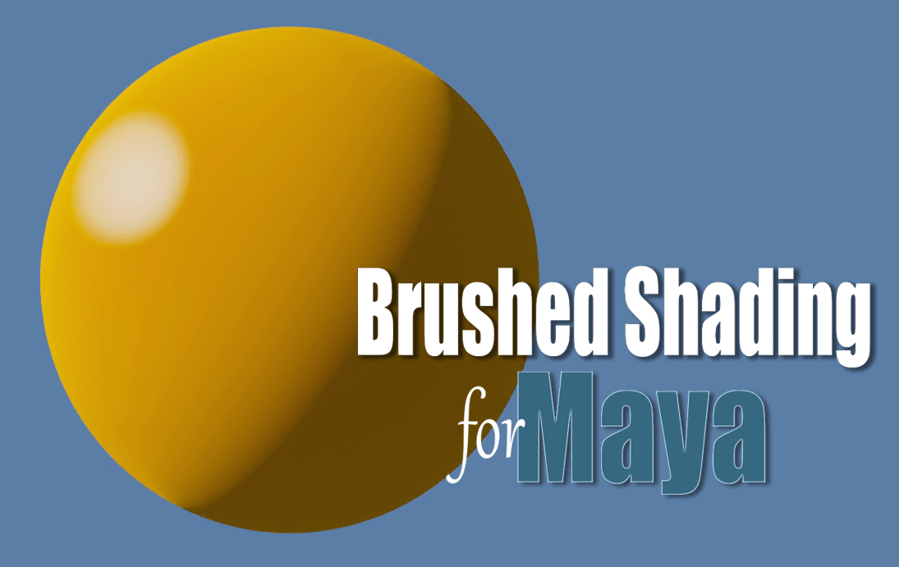
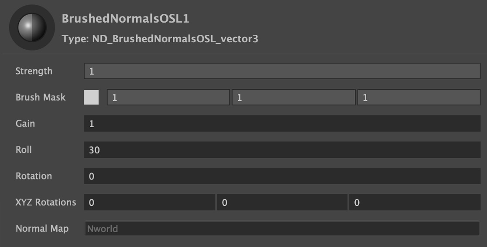

.
## [Brushed Shading for Maya/MaterialX](../index_maya.md)
# Brushed Normals

Transforms regular smooth shading into brushed shading by rotating the object normals through the brush stroke map, emulating how an artist shades transitions from light to dark by dragging their brush through paint.

## Inputs / Parameters

**Strength** 

A normalized slider to control the overall effect, from zero (no effect) to 1 (100%).

**Brush Mask** 

This is where you input the Triplanar brush strokes texture map, used to smear an object’s shading normals along the brush strokes. 

**Gain**

A modifier for the brush strokes map, acting as a multiplier, where a value of 1 does nothing, and value above 1 brighten the map, while values below 1 darken it. 

**Roll** 

Rotates the world normals based on a "paint-roller" effect. Effectively smearing the object’s shading normals along the brush strokes. 

**XYZ Rotation** 

Rotations in world space are converted into screen space, determining the starting direction angle of the roll. Internal yaw and pitch functions in the shader make this unnecessary in most cases.

# Brushed Normals OSL

An OSL version with added parameter for screen space rotation. Note that OSL shaders have a warning in LookdevX (Maya 2026.3) that they "may not compile" which can be ignored. 

## Inputs / Parameters

**Strength** 

A normalized slider to control the overall effect, from zero (no effect) to 1 (100%).

**Brush Mask** 

This is where you input the Triplanar brush strokes texture map, used to smear an object’s shading normals along the brush strokes. 

**Gain**

A modifier for the brush strokes map, acting as a multiplier, where a value of 1 does nothing, and value above 1 brighten the map, while values below 1 darken it. 

**Roll** 

Rotates the world normals based on a "paint-roller" effect. Effectively smearing the object’s shading normals along the brush strokes. 

**XYZ Rotation** 

Rotations in world space are converted into screen space, determining the starting direction angle of the roll. Internal yaw and pitch functions in the shader make this unnecessary in most cases.

**Rotation** 

Rotates the roll direction clockwise in degrees. At the default value of zero (0) the roll is pointing downwards in screen space so that the roll travels from the top to the bottom. A value of 45 will rotate the roll clockwise 45 degrees in screen space, and -45 will rotate counterclockwise 45 degrees.

**Normal Map**

Input for tangent space normal maps. Note that both *Brushed Normals OSL* and *Brushed Normals* can also be combined with a MaterialX *normalmap* by connecting them to the normals input.
