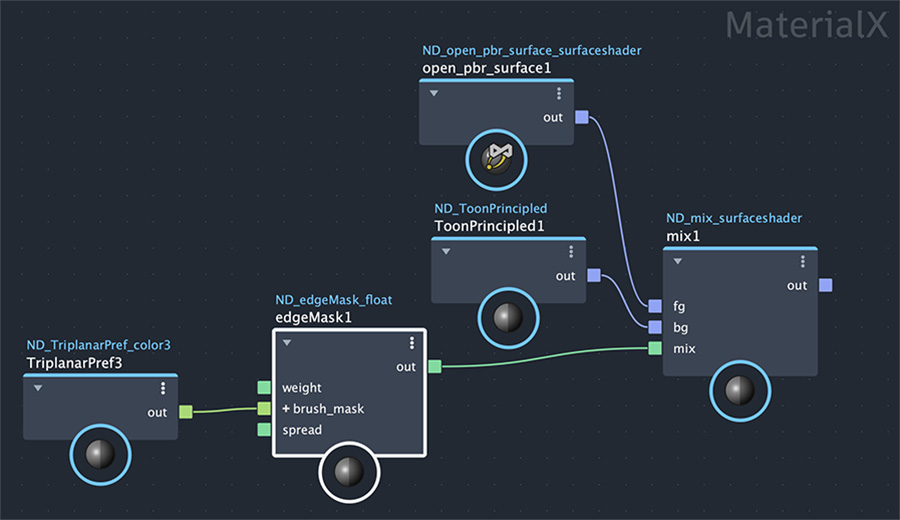
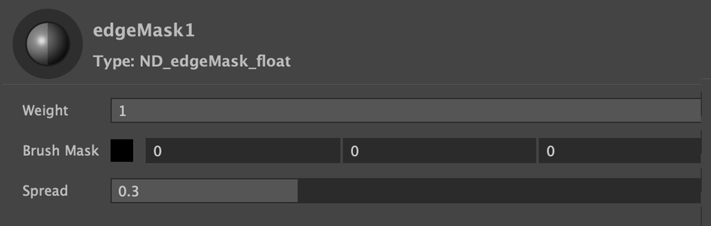

## [Brushed Shading for Maya/MaterialX](../index_maya.md)
# Edge Mask

Facing ratio edge transitioning from white, into masked (with brush strokes), then to black. Use as a mix for a mix shader to add a brushed toon sheen component.

## Inputs / Parameters

**Strength** 

A normalized slider to control the overall effect, from zero (no effect) to 1 (100%).

**Brush Mask**

**Spread**

