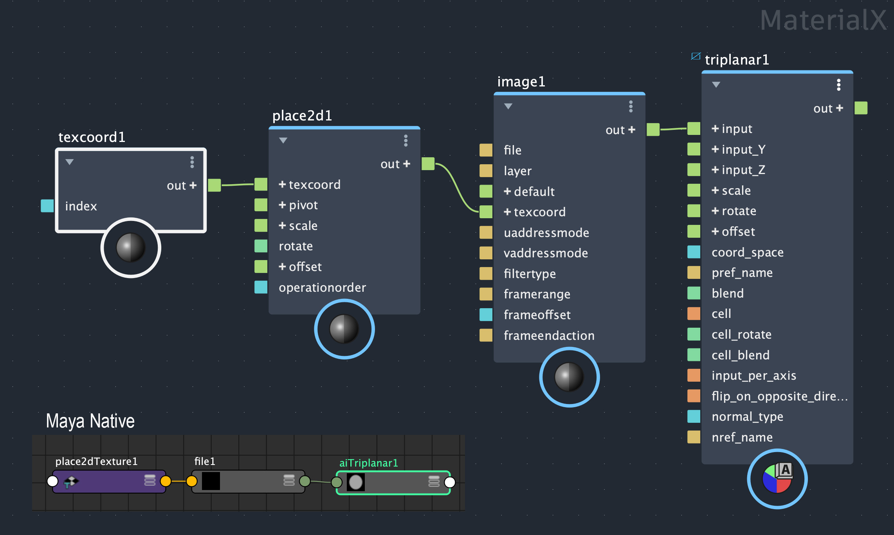

.
## [Brushed Shading for Maya/MaterialX](../index_maya.md)
# Brushed Shading Menu

The following menu items are included to make the brushed shading workflow possible in an animation production pipeline.

## Create Texture Reference Objects
Creates texture reference objects for the selected meshes, and exports their reference normals (Nref). 

This extends the Maya *texture/Create Texture Reference Object* to work on all selected meshes, and additionnally exports the mesh's reference normals (Nref) which are needed by the  node. 

## Create Lambert RGB in selected Doc
Creates a Lambert RGB (aiUtility) in the selected MaterialX document. This turns Lambertian diffuse shading into an RGB channel which is useful for NPR workflows, for example with tone mapping.

## Create Specular RGB network in selected Doc
Creates a Specular RGB network in the selected MaterialX document. This turns specular  shading into an RGB channel which is useful for NPR workflows, for example with tone mapping.

## Create Triplanar Network in selected Doc
Creates an aiTriplanar network in the selected MaterialX document. This node network is the Arnold equivalent to the  node. One case where this is useful is having the triplanar brush map in a custom AOV for use in compositing, which plays a huge part in an NPR workflow. Unfortunately, Maya2026.3 does not support MaterialX nodes in custom AOVs. A work around is to make the equivalant node network in native Maya nodes using the Node Editor or Hypershade. In the inset of the image below, you can see these native Maya node network which parallels the MaterialX node network.

