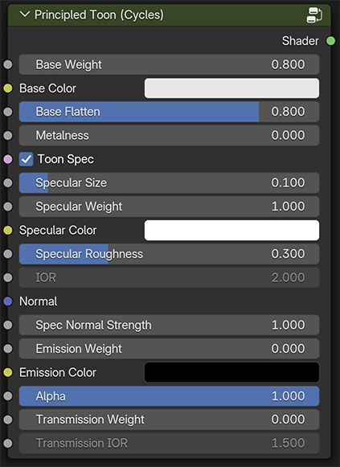
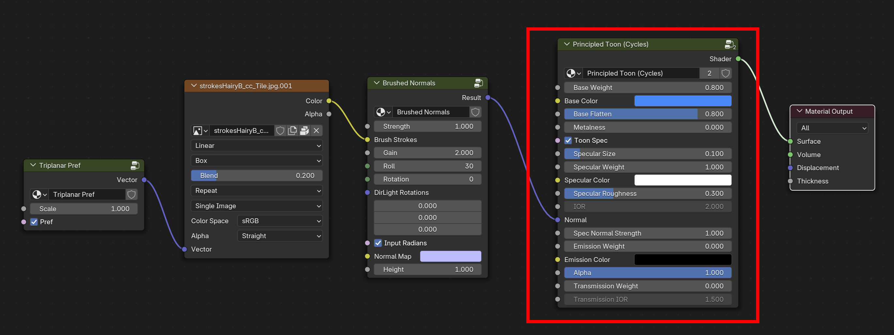

# Principled Toon

Combines the Toon BSDF for both glossy and diffuse into the familiar structure of Blender’s Principled BRDF, or more properly, into the structure of OpenPBR. Includes controls for stylized metal and glass. Note that because Blender's Toon BSDF only works with Cycles, the same is true for the Principled Toon. If you wish to render in EEVEE you can connect the other shader node components into any material.

## Inputs / Parameters

**Base Weight**

Scalar multiplier for Base Color

**Base Color**

Overall color of the material used for diffuse, metal and transmission.

**Base Flatten**

Controls how smooth or sharp the diffuse shading is. Works by coupling the size and smooth controls of a toon BSDF together into a single slider, where the smooth is the inverse of the size. Intended to emulate the flattening parameter in the Moonray toon shader. 

**Metalness**

A mix between dielectric shading and toon metallic. Uses two lobes of Glossy Toon BSDF for the reflections to get a stylized metallic look. When enabled, Specular Size controls the specular dot (which takes its color from the Specular Color), whereas the Specular Roughness controls the overall material roughness of the metal’s tinted reflections. 

**Toon Spec** 

Toggle between toon specular (Toon Glossy BSDF), and microfacet GGX specular. 

**Specular Size**

Gives an angle of reflection between 0° and 45°.

**Specular Weight**

Scalar multiplier for Specular Color.

**Specular Color**

Color tint for specular highlight.

**Specular Roughness**

Specifies the roughness of the surface for specular reflection. When Toon Spec is enabled, this controls the toon glossy smoothness. That is, it specifies an angle over which a smooth transition from full to no reflection happens.

**IOR**

Index of refraction for the GGX spec. Defaults to a physically implausible value of 2.0, since we are doing non-physically based rendering (NPR), producing a broader specular highlight. 

**Normal**

Controls the normals of the base layers.

**Spec Normal Strength** 

Controls the amount that the specular is affected by the normal. 

**Emission Weight**

Scalar multiplier for Emission Color.

**Emission Color**

Light emission from the surface.

**Alpha** 

Controls the opacity of the surface. Usually linked to the Alpha output of an Image Texture node.

**Transmission Weight**

Enables stylized glass, which is a mix between refraction at glancing angles and transparency. This allows for stylized glass where indirect reflections and global illumination are disabled for NPR lighting. That is, where the max light bounce is set to zero for diffuse and glossy. 

With both diffuse and glossy rays at zero (0) the glass will appear darkened. Enabling diffuse rays removes the darkening. Enabling glossy rays produces lighter glass.

**Transmission IOR**

Index of refraction for transmission.

## Example material node network

