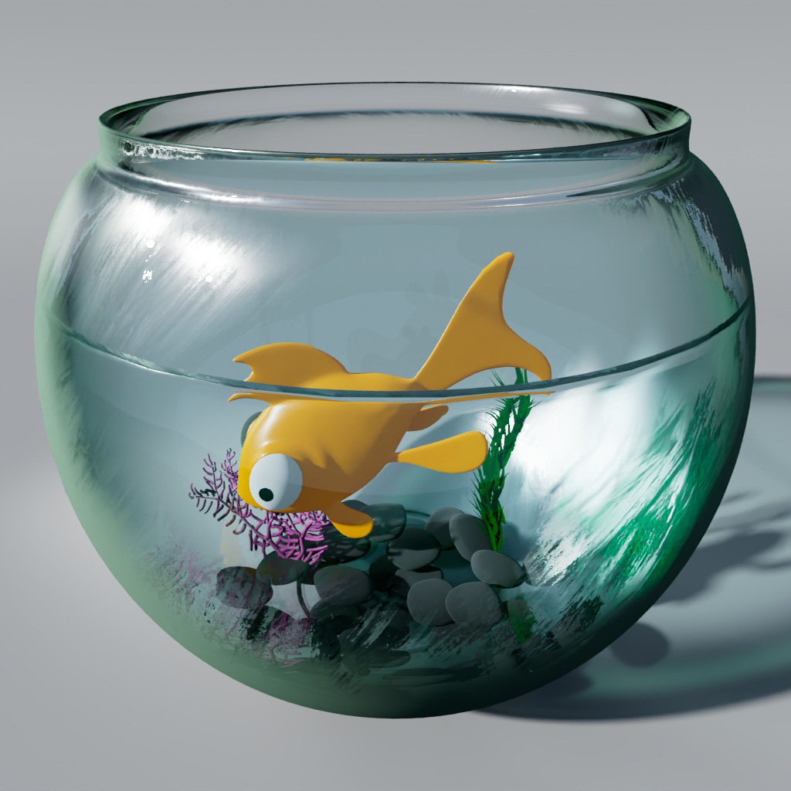
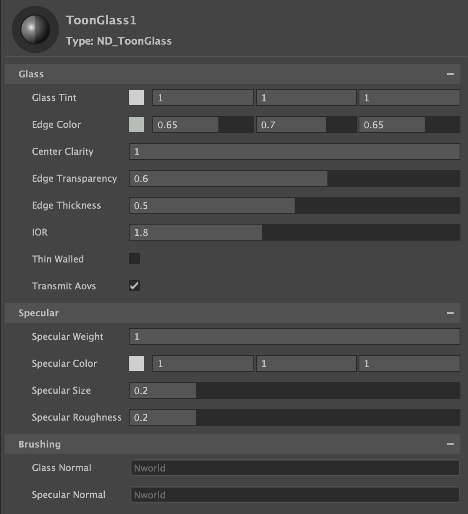

.
## [Brushed Shading for Maya/MaterialX](../index_maya.md)
# Toon Glass (Arnold)

Stylized glass surface. Includes center clarity, edge thickness, and specular tone mapping.

## Inputs / Parameters

**Glass Tint**

Tints the color of the glass.

**Edge Color**

The color of the edge, representing the thicker part of the glass viewed from glancing angles.

**Center Clarity**

Amount eminating from the center outwards to have no effect to the brush shading on the refraction.

**Edge Transparency**

Amount of transparency for the edge. A value of 0 will make the edges complete;y opaque.

**Edge Thickness**

Thickness of the stylized edge.

**IOR**

The Specular IOR defines the index of refraction (IOR) of the base dielectric. Higher IORs produce a stronger specular reflection.

**Thin Walled**

In the thin-walled mode, the surface is considered to be a (microscopically) thin two-dimensional sheet of material, rather than the boundary of a solid object. This is intended for the convenient and efficient rendering of thin materials (such as window panes, soap bubbles, sheets of paper, and leaves) as open meshes rather than closed thick shells.

**Transmit AOVs**

When enabled, Transmission will pass through AOVs. If the background is transparent, then the transmissive surface will become transparent so that it can be composited over another background. Light path expression AOVs will be passed through so that, for example, a diffuse surface seen through a transmissive surface will end up in the Diffuse AOV. Other AOVs can also be passed straight through (without any opacity blending), which can be used for creating masks, for example.

## Specular

**Toon Spec** 

Toggle between toon specular (Toon Glossy BSDF), and microfacet GGX specular. 

**Specular Weight**

Scalar multiplier for Specular Color.

**Specular Color**

Color tint for specular highlight.

**Specular Size**

Tonemaps the specular highlight to create a sharp circular specular highlight

**Specular Roughness**

Specifies the roughness of the surface for specular reflection. Generally you want to keep this high (dafault 0.6), using Specular Size.

## Brushing

**Glass Normal** 

Input for brushed Normals affecting the glass.

**Specular Normal** 

Input for brushed Normals affecting the specular.
