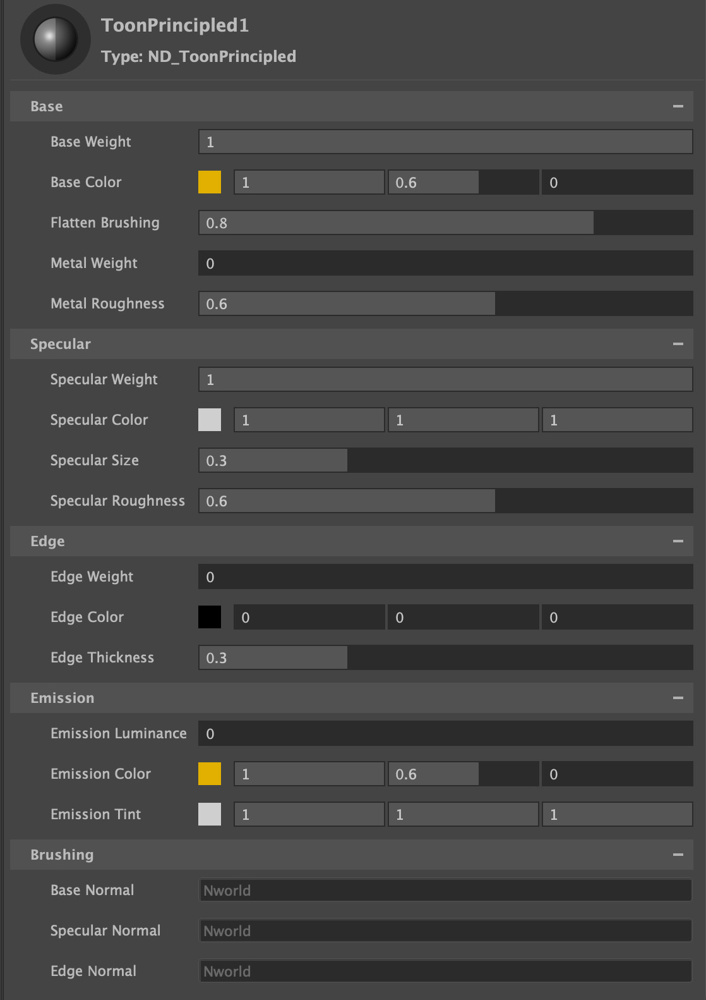

.
# Toon Principled (Arnold)

Based on OpenPBR, but designed for NPR rendering.  

## Inputs / Parameters

**Base Weight**

Scalar multiplier for Base Color

**Base Color**

Overall color of the material used for diffuse and metal.

**Flatten Brushing**

Blending between smooth shading normals and brushed normals. A value of 0 is complete brushed normals across the diffuse surface, increased values will move the transition from smooth shading to brushed shading along the light direction, with a value of 1 creating smooth shading right up to the light terminator where it will switch into brushed shading.

Node that the diffuse shading is in energy preserving Oren-Nayer (EON) to produce a flattened toon look.

**Metal Weight*

A mix between dielectric shading and toon metallic. Uses two specular lobes, one tinted with the base color, to get a stylized metallic look. 

**Metal Roughness**

Roughness of the metal specular lobe.

**Toon Spec** 

Toggle between toon specular (Toon Glossy BSDF), and microfacet GGX specular. 

**Specular Weight**

Scalar multiplier for Specular Color.

**Specular Color**

Color tint for specular highlight.

**Specular Size**

Tonemaps the specular highlight to create a sharp circular specular highlight

**Specular Roughness**

Specifies the roughness of the surface for specular reflection. Generally you want to keep this high (dafault 0.6), using Specular Size.

**Edge**

The edge uses tonemapped facing ratio, to create a stylized edging that can be used for metals, cloth. 

**Edge Weight**

Scalar multiplier for Edge Color.

**Edge Color**

The color of the stylized edge. Note that black can be used for darkening as well as lightening.

**Edge Thickness**

Controlls the thickness of the edge.

**Emission Luminace**

Controls the amount of emitted light, specified as a luminance in nits (candela per square meter). 

**Emission Color**

The emission color is multiplied by the white light of the given emission luminance to obtain the final RGB emission.

**Emission Tint**

Multiplier for tinting the emission color. Useful for stylized (flat) skin looks by tinting with red for the sub-dermal layer.

**Base Normal** 

Input for brushed Normals affecting the base.

**Specular Normal** 

Input for brushed Normals affecting the specular.

**Edge Normal** 

Input for brushed Normals affecting the edge.

