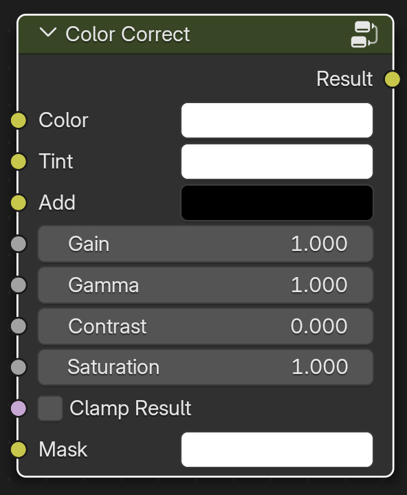

.
# Color Correct

Utility node for color correcting in the Shader Editor.

# Inputs / Parameters

**Color**

Input color to apply the color correction to.

**Tint**

Color multiplier to tint the color.

**Add**

Adds this value to the color. 

**Gain**

A gain is a multiplier like the tint, but with a single float value. 

**Gamma**

Applies a gamma correction to the color.

**Contrast**

A scaling type factor by which to make brighter pixels brighter, but keeping the darker pixels dark. Higher values make details stand out. 
Use a negative number to decrease the overall contrast in the image.

**Saturation**

A value of 0 removes color from the image, making it black-and-white. A value greater than 1.0 increases saturation.

**Clamp Result**

Clamps output values outside of the 0 to 1 range.

**Mask**

Blends between the input color and the color-corrected one.
