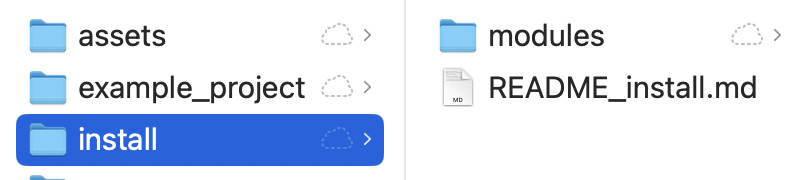

.
## [Brushed Shading for Maya/MaterialX](../index_maya.md)
## Requirements

BrushedShading for Maya v1.0 requires Maya 2026.3 or later.

## Installation

To install, place the *install/modules* folder containing the BrushedShading.mod file and BrushedShading_pkg folder into your Maya folder. 
If you already have a modules folder there, you can add the content into that.

(Windows®)

    drive:\Users\username\Documents\maya\modules\

(Mac OS X)

    /Users/username/Library/Preferences/Autodesk/maya/modules/

Note: To open the Preferences directory on MacOS:

    Select Finder > Go > Go to Folder and type the directory path (/Users/username/Library/Preferences).

This will add the BrushedShading nodedefs to a custom MaterialX library, and create a BrushedShading menu in Maya.

You can also load the custom MaterialX library in the LookdevX section of the Preferences,
pointing it to the BrushedShading_pkg/scripts/library/BrushedShading/ folder.

