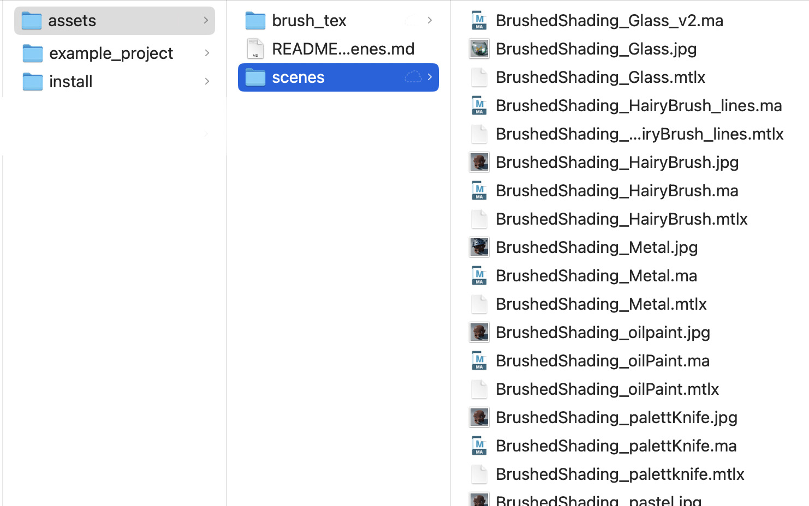

.
## [Brushed Shading for Maya/MaterialX](../index_maya.md)
# Example Looks

Because Brushed Shading works with hand-painted brush strokes, there are almost endless artistic looks you can achieve. Brush Shading for Maya comes with several examples of the different looks you can achieve, including watercolor, oil paint, pastel, palette knife, and pencil hatch. You can also make your own custom brushes to get your own personal style.

## Look Assets folder

You will find the looks in the *assets* folder. Each look consists of a MaterialX file, a corresponding Maya file showing the look, and a image showing that scene rendered. In  brush texture, and Maya file. The *brush_tex* folder you will find all of the brush maps used in the looks. These are in 16-bit EXR format with DWAB compression in linear (AGEScg) color space.

## Relative paths in Maya MaterialX

Maya2026.3 does not support relative paths for loaded MaterialX documents. This will be hopefully be supported in a future release of Maya.

You will therefore see an error like this when opening the example Maya scenes:

    # Error: RuntimeError: Cannot display material(s) for the node: |materialXStack1|materialXStackShape1,%BrushedShading_HairyBrush.

In the Outliner, right-click on the  materialXStackShape and choose "Load MaterialX document..." to load the corresponding .mtlx document. 

example:
	Maya: 		BrushedShading_HairyBrush.ma
	MaterialX:  BrushedShading_HairyBrush.mtlx

The doc should load in with the materials assigned to the geometry and ready to render. 
You can now save the Maya file and the paths will be updated to the location on your computer.
