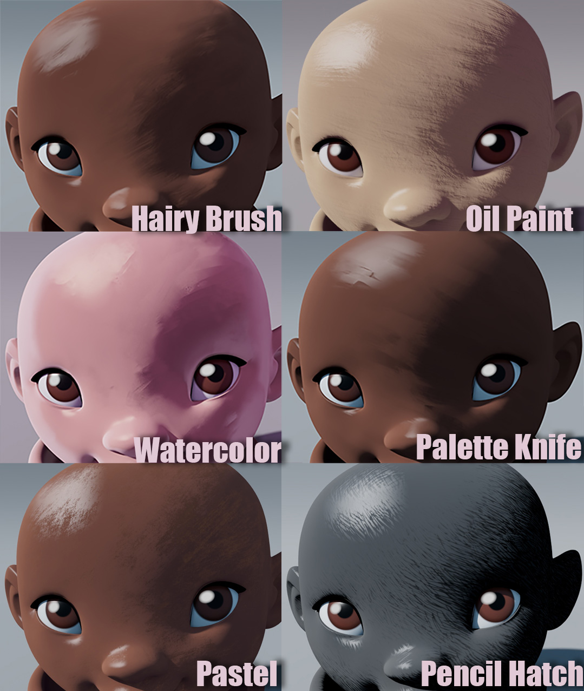

.
## [Brushed Shading for Maya/MaterialX](../index_maya.md)
# Example Looks

Because Brushed Shading works with hand-painted brush strokes, there are almost endless artistic looks you can achieve. Brush Shading for Maya comes with several examples of the different looks you can achieve, including watercolor, oil paint, pastel, palette knife, and pencil hatch. You can also make your own custom brushes to get your own personal style.

You will find the looks in the *assets* folder. Each look consists of a MaterialX file, brush texture, and Maya file.

