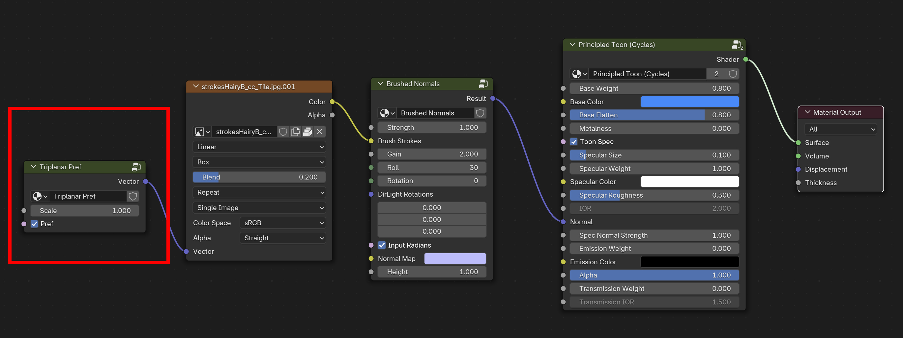

.
# Triplanar Pref

Maps the Texture Coordinates for triplanar projection mapping (referred to as "box" projection mapping in Blender) into either object coordinates or into a Pref attribute of a [Texture Reference Pose](texRef.md).

## Parameters

**Scale**

Ganged slider controlling the scale of the projected texture map equally across each XYZ axis. 

**Pref**

Toggle between object space coordinates and Pref (Position Reference) coordinates. 
Pref coordinates are associated with a [Texture Reference Pose](texRef.md), which stores the position of the mesh at its reference pose. This allows the projected textures to "stick" to a deforming animated surface.

## Example material node network

