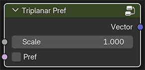

# Triplanar Pref

Maps the Texture Coordinates for triplanar projection mapping (Box mapping) into either object coordinates or to a Pref attribute of a Texture Reference Pose.

## Parameters

**Scale**

Controls the scale of the texture map.

**Pref**

Toggle between object space coordinates and Pref (Position Reference) coordinates. 
Pref coordinates are associated with a Texture Reference Pose to make the textures "stick" to a deforming animated surface.

