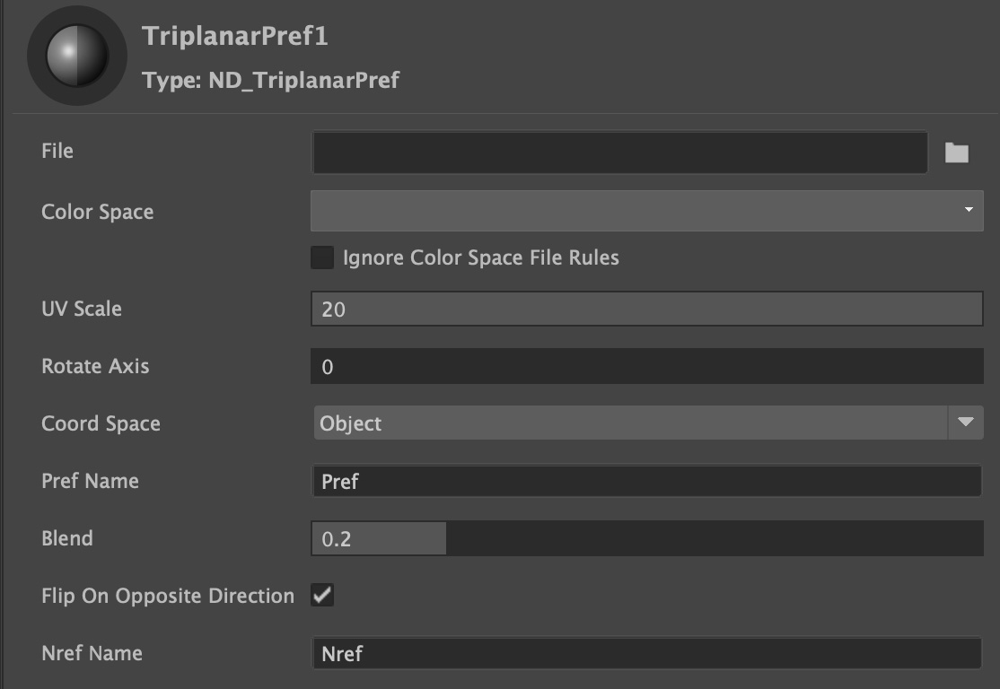

.
## [Brushed Shading for Maya/MaterialX](../index_maya.md)
# Triplanar Pref

Implements many of the Arnold Triplanar map features, using standard MaterialX nodes so it is render agnotic. Most importantly, this includes texture position reference attributes (Pref). 

For painterly renders, we don’t want to have the brush strokes be UV mapped to the objects, because then their size will be locked to the characters. Instead, just as an artist paints the brush strokes on the canvas, we also want our brush strokes to be independent of the object's UVs, and determined per shot.

We can do this using Triplanar projections, but this presents a problem with animated characters: They will appear to “swim” through the brush strokes.

Here Pref (position reference) and Nref (Normal reference) attributes are used to make projections “stick” to characters. 

## Parameters

**File**

This is where you load the brush texture map. You will find the brush maps in 
assets/brush_tex/

**Color Space**

Brush maps are in EXR and so would be Raw (typically ACEScg)

**UV Scale**

Ganged slider controlling the scale of the texture map equally in U and V. Because the scale is applied to the texcoords before projecting, scaling works intuitivley, so larger values will produce a larger scale image. 

**Rotate Axis**

Rotate the texture in degrees, pivoting in the center of its texcoords.

**Coord Space**

Specifies the coordinate space to use. These include World, Object, and Pref coordinates. Pref is short for 'vertex in reference pose'. The plugin can pass these vertices to Arnold (in addition to the regular, deformed vertices), which can, in turn, be queried by the triplanar shader so that the texture 'sticks' to the reference pose and does not swim as the mesh deforms.

  - Object space, where points are expressed relative to the local origin (center) of the object.
  - World space, where points are relative to the global origin of the scene.
  - Pref, which isn’t really a space, but rather a reference to a bind pose (note Pref does not work with NURBS surfaces).

**Pref Name**

Specify the name of the reference position user-data array. By default "Pref".

**Blend**

Blends together the projected textures from each side smoothly.

**Flip on Opposite Direction**

Used to control the behavior of the shader on faces facing the corresponding negative axis, if set to true a vertical symmetry transformation is applied to the texture on faces facing the opposite direction.

**Nref Name**

Name of the user data parameter for the reference normals (by default "Nref")

