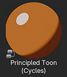
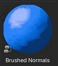
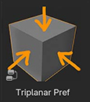
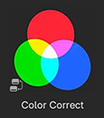

# Brushed Shading for Blender

## Installation

## Add-Ons
[Shader Transfer](docs/shaderTransfer.md)

[Create Texture Reference](docs/texRef.md)
   
## Material Asset Library

[Principled Toon](docs/PrincipledToon.md)

[Brushed Normals](docs/BrushNormals.md)

[Triplanar Pref](docs/triPref.md)

[Color Correct](docs/cc.md)
