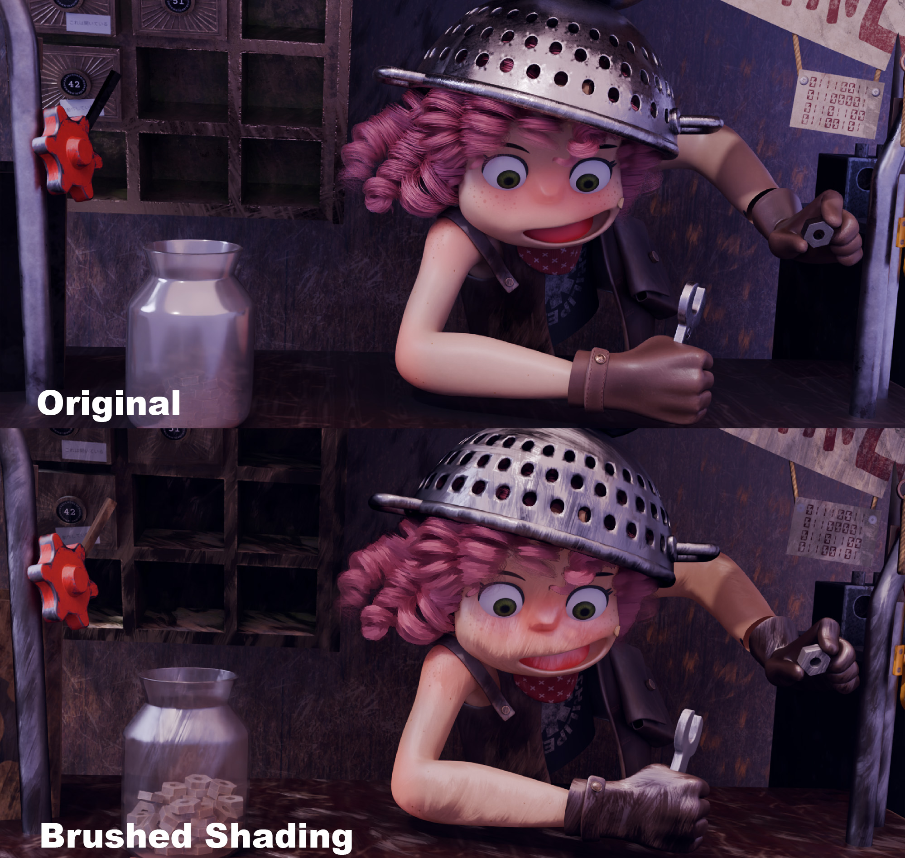

# Brushed Shading for Blender

*Brushed Shading for Blender* is a suite of tools for achieving painterly stylized looks in both EEEVEE and Cycles render. It does this by transforming regular smooth shading into hand-painted brush stroke shading. 

## Material Asset Library

Because Brushed Shading works with hand-painted brush strokes, there are almost endless artistic looks you can achieve. The material library comes with several examples, including watercolor, oil paint, pastel, palette knife, and pencil sketch. You can make your own custom brushes to get your own personal style.

## Material Asset Library - Shader Nodes

The Asset library includes the components you’ll need to build a Brushed Shading material node network. 

See the pages below for documentation for each of these material nodes.

[Principled Toon](docs/PrincipledToon.md)

[Brushed Normals](docs/BrushNormals.md)

[Triplanar Pref](docs/triPref.md)

[Color Correct](docs/cc.md)

## Add-Ons / Tools

The following Add-ons extend Blender’s functionality to make the brushed shading workflow possible in an animation production.

[Asset Shader Transfer](docs/shaderTransfer.md)

[Create Texture Reference Pose](docs/texRef.md)

## Installation

Brushed Shading is packaged as a Blender Extension. So all you need to do is load the .zip file into the preferences. 

Inside the zip file, you will also find many resources, including 

- an example scene for you to try out
- the brush maps
- an OSL (Open Shading Language) implementation of the [Brushed Normals](docs/BrushNormals.md)

## Tutorials
