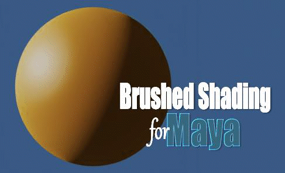

.
# Brushed Shading for Maya

*Brushed Shading for Maya* Brushed Shading for Maya is a suite of shaders and tools for achieving painterly stylized looks in Maya Arnold using MaterialX. It does this by transforming regular smooth shading into hand-painted brush stroke shading. 

## How it works

Brushed Shading turns regular smooth shading into the look of hand-painted brush strokes. This is done with custom shaders that changes regular smooth shading into “brush stroke shading” by smearing the shading normals through a hand-painted brush strokes map, emulating how an artist shades transitions from light to dark by dragging their brush through paint onto a canvas.

## Example Looks

Because Brushed Shading works with hand-painted brush strokes, there are almost endless artistic looks you can achieve. Brush Shading for Maya comes with several examples of the different looks you can achieve, including watercolor, oil paint, pastel, palette knife, and pencil hatch. You can also make your own custom brushes to get your own personal style. Each look consists of a MaterialX file, brush texture, and Maya file.

## MaterialX Node Library

The custom MaterialX Node Library includes all the components you’ll need to build your own Brushed Shading material node networks. Each shader node is detailed below in the linked documentation pages.

> [Toon Principled](docs/ToonPrincipled_maya.md)

> [Toon Glass](docs/ToonGlass_maya.md)

> [Brushed Normals](docs/BrushNormals_maya.md)

> [Triplanar Pref](docs/triPref_maya.md)

## Brushed Shading Menu

The following menu items are included to make the brushed shading workflow possible in an animation production pipeline.

> **Create Texture Reference Objects**   Creates texture reference objects for the selected meshes, and exports their reference normals (Nref). 

> **Create Lambert RGB in selected Doc**   Creates a Lambert RGB (aiUtility) in the selected MaterialX document. 

> **Create Specular RGB network in selected Doc**   Creates a Specular RGB network in the selected MaterialX document.

> **Create Triplanar Network in selected Doc**   Creates an aiTriplanar network in the selected MaterialX document.

## Example Project

To help get you started, an example Maya project is included featuring the wonderful FeiFei model by Leo Rezende. This is a production ready shot lighting scene including camera, lights, animation cache, hand painted texture maps, and of course Brushed Shading material node networks.

## Requirements

Brushed Shading for Maya requires Maya 2026.3 and up, and was designed for rendering in Arnold.

Both the Toon Principled and Toon Glass shaders use Arnold MaterialX nodes, and so will only render with Arnold. The other shader nodes (Triplanar Pref, Brushed Normals) are made using standard MaterialX nodes, and so should be render agnostic.

