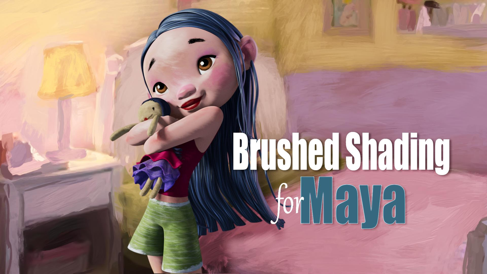
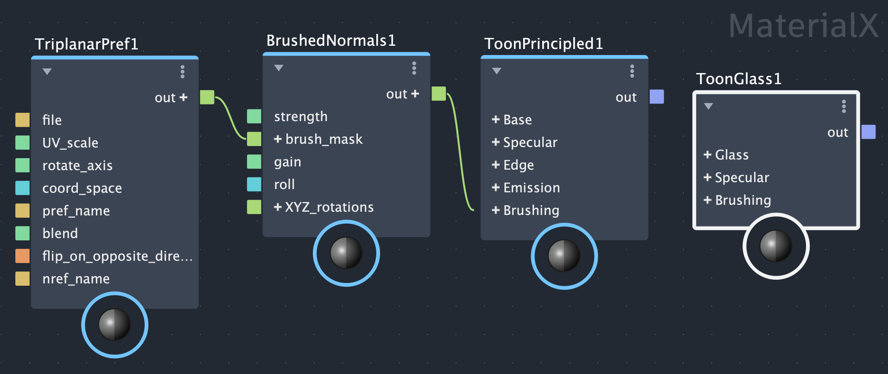
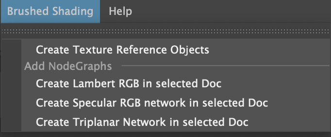

.
# Brushed Shading for Maya Documentation
[Download Brushed Shading for Maya](https://sharktacos.gumroad.com/l/BrushedShading_Maya)

[Watch Brushed Shading for Maya video tutorials](https://youtu.be/OPMcgrchrA8?si=RRSnj7qmrY_om6Aw)

*Brushed Shading for Maya* Brushed Shading for Maya is a suite of shaders and tools for achieving painterly stylized looks in Maya Arnold using MaterialX. It does this by transforming regular smooth shading into hand-painted brush stroke shading. 

## [Installation](install_Maya.md)

See above linked documentation page for installation instructions.

## MaterialX Node Library

The custom MaterialX Node Library includes all the components you’ll need to build your own Brushed Shading material node networks. Each shader node is detailed below in the linked documentation pages.

> [Toon Principled](docs/ToonPrincipled_maya.md)

> [Toon Glass](docs/ToonGlass_maya.md)

> [Brushed Normals](docs/BrushNormals_maya.md)

> [Triplanar Pref](docs/triPref_maya.md)

## [Brushed Shading Menu](MayaMenu.md)

Menu of useful utility functions. See above linked documentation.

## [Example Looks](docs/looks_Maya.md)

Brush Shading for Maya comes with several examples of the different looks you can achieve, including watercolor, oil paint, pastel, palette knife, and pencil hatch. 

See above linked documentation for the catalog of example looks.

## Example Project

To help get you started, an example Maya project is included featuring the wonderful FeiFei model by Leo Rezende. This is a production ready shot lighting scene including camera, lights, animation cache, hand painted texture maps, and of course Brushed Shading material node networks.

## Requirements

Brushed Shading for Maya requires Maya 2026.3 and up, and was designed for rendering in Arnold.

Both the Toon Principled and Toon Glass shaders use Arnold MaterialX nodes, and so will only render with Arnold. The other shader nodes (Triplanar Pref, Brushed Normals) are made using standard MaterialX nodes, and so should be render agnostic.

## Installation

To install, place the *install/modules* folder containing the BrushedShading.mod file and BrushedShading_pkg folder into your Maya folder. 
If you already have a modules folder there, you can add the content into that.

(Windows®)

    drive:\Users\username\Documents\maya\modules\

(Mac OS X)

    /Users/username/Library/Preferences/Autodesk/maya/modules/

Note: To open the Preferences directory on MacOS:

    Select Finder > Go > Go to Folder and type the directory path (/Users/username/Library/Preferences).

This will add the BrushedShading nodedefs to a custom MaterialX library, and create a BrushedShading menu in Maya.

You can also load the custom MaterialX library in the LookdevX section of the Preferences,
pointing it to the BrushedShading_pkg/scripts/library/BrushedShading/ folder.

