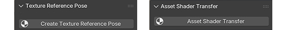
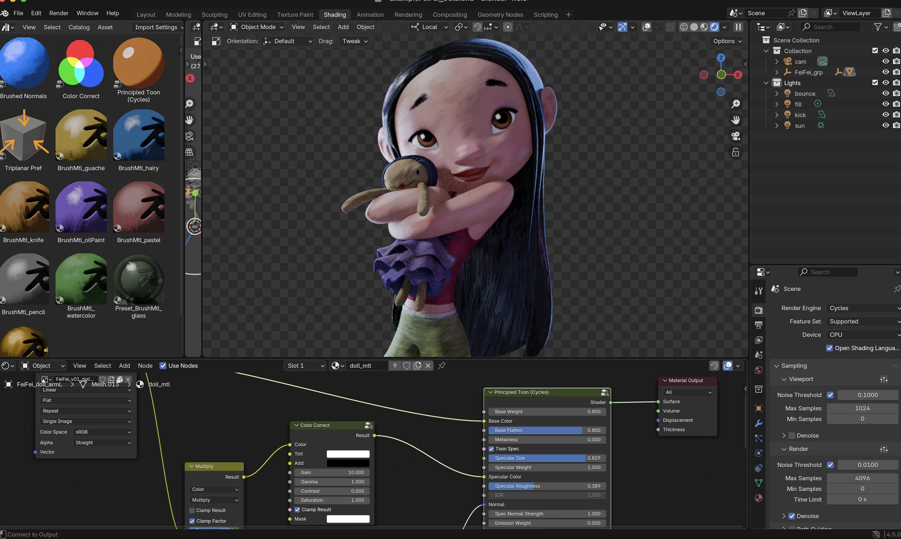
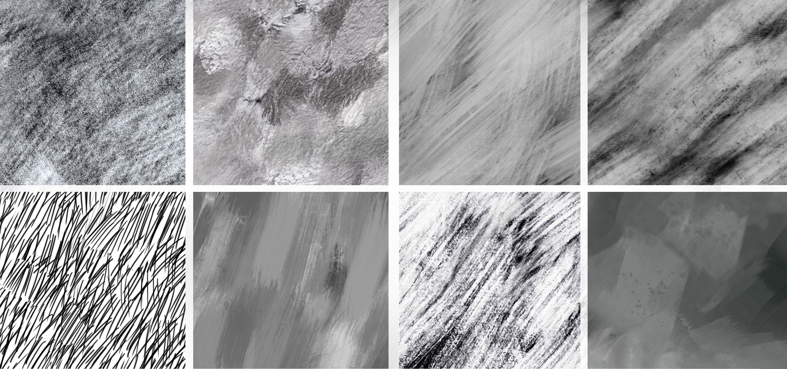

*Brushed Shading for Maya* Brushed Shading for Maya is a suite of shaders and tools for achieving painterly stylized looks in Maya Arnold using MaterialX. It does this by transforming regular smooth shading into hand-painted brush stroke shading. 

## How it works

Brushed Shading turns regular smooth shading into the look of hand-painted brush strokes. This is done with custom shaders that changes regular smooth shading into “brush stroke shading” by smearing the shading normals through a hand-painted brush strokes map, emulating how an artist shades transitions from light to dark by dragging their brush through paint onto a canvas.

## Example Looks

Because Brushed Shading works with hand-painted brush strokes, there are almost endless artistic looks you can achieve. Brush Shading for Maya comes with several examples of the different looks you can achieve, including watercolor, oil paint, pastel, palette knife, and pencil hatch. You can also make your own custom brushes to get your own personal style. Each look consists of a MaterialX file, brush texture, and Maya file.

MaterialX Node Library

The custom MaterialX Node Library includes all the components you’ll need to build your own Brushed Shading material node networks. Each shader node is detailed below in the linked documentation pages.

> [Toon Principled](docs/ToonPrincipled_maya.md)

> [Toon Glass](docs/ToonGlass_maya.md)

> [Brushed Normals](docs/BrushNormals_maya.md)

> [Triplanar Pref](docs/triPref_maya.md)

## Brushed Shading Menu

The following menu items are included to make the brushed shading workflow possible in an animation production pipeline.

> [Asset Shader Transfer](docs/shaderTransfer.md)

> [Texture Reference Pose](docs/texRef.md)

## Installation

Brushed Shading is packaged as a Blender Extension. So installing and maintaining is a breeze. As explained in the <a href="https://docs.blender.org/manual/en/latest/editors/preferences/extensions.html" target="_blank">Get Extensions</a> page of the Blender docs, to install from disk you can either use the drop-down menu in the top right of the Preferences, or drag-and-drop the extension .zip package into Blender. This will install the add-ons as well as the Material Asset Library. 

## Resources

Inside the extension .zip package, you will also find many resources, including 

- In the *examples* folder, you'll find a blender scene with the awesome FeiFei model by Leo Rezende for you to try out. The scene comes with texture maps and brushed shading materials.
  
- In the *textures* folder, you'll find all the tiled brush maps used in the material library presets.
  
- In the *shaders* folder, you'll find two OSL shaders. One for Blender, and another for Maya.

## Tutorials

Coming Soon!
